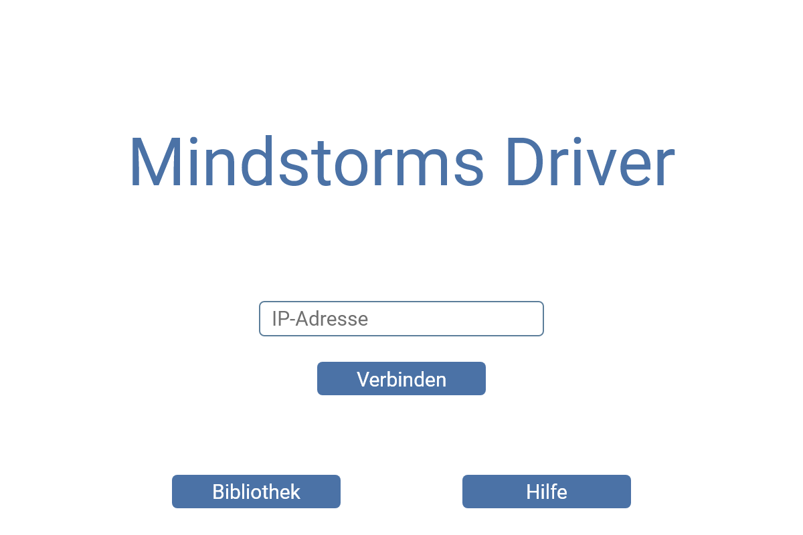
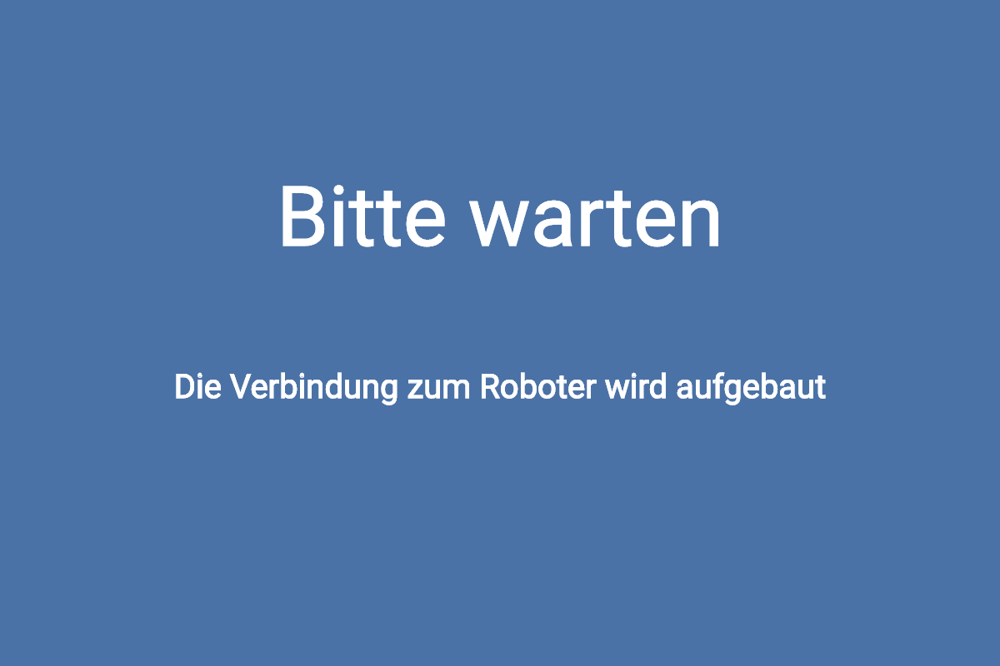
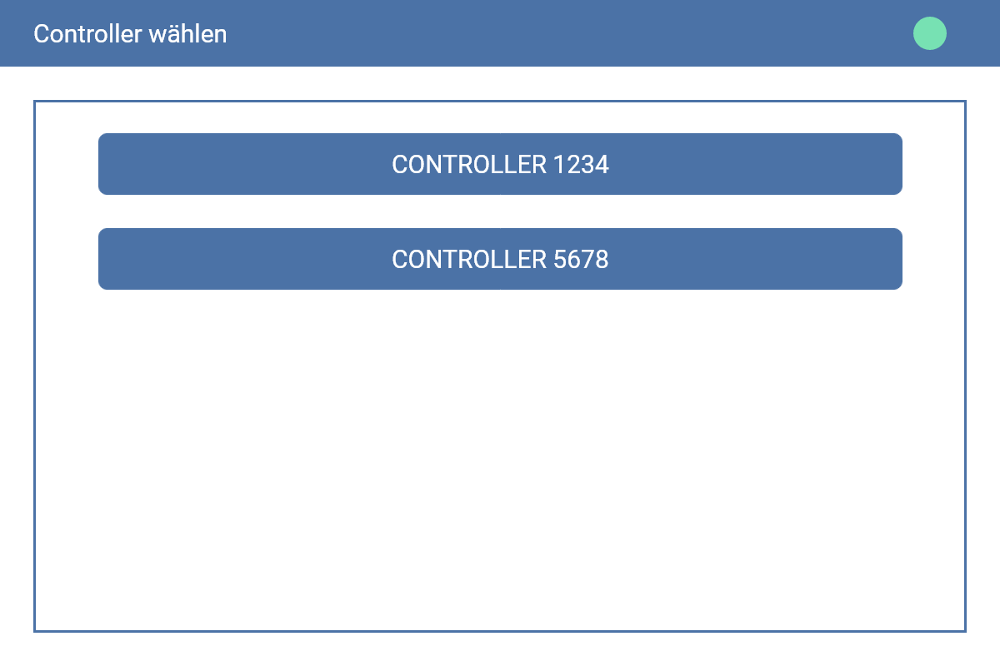
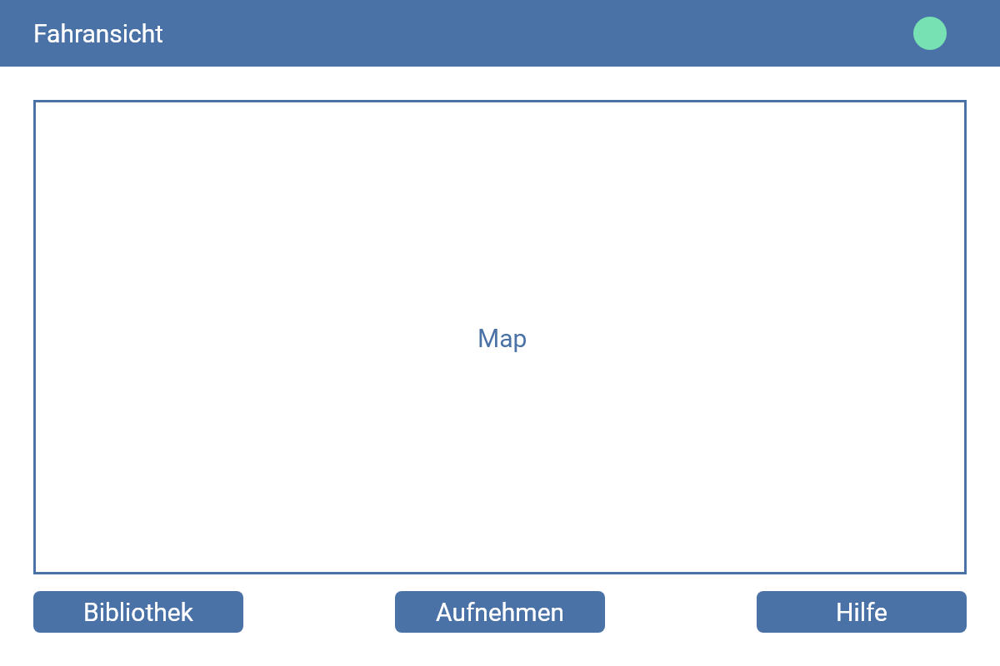
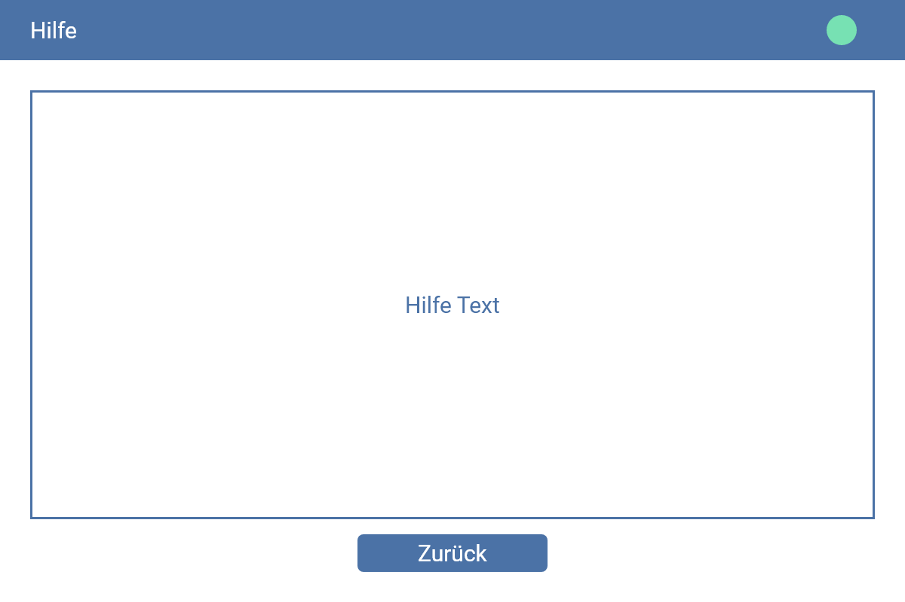
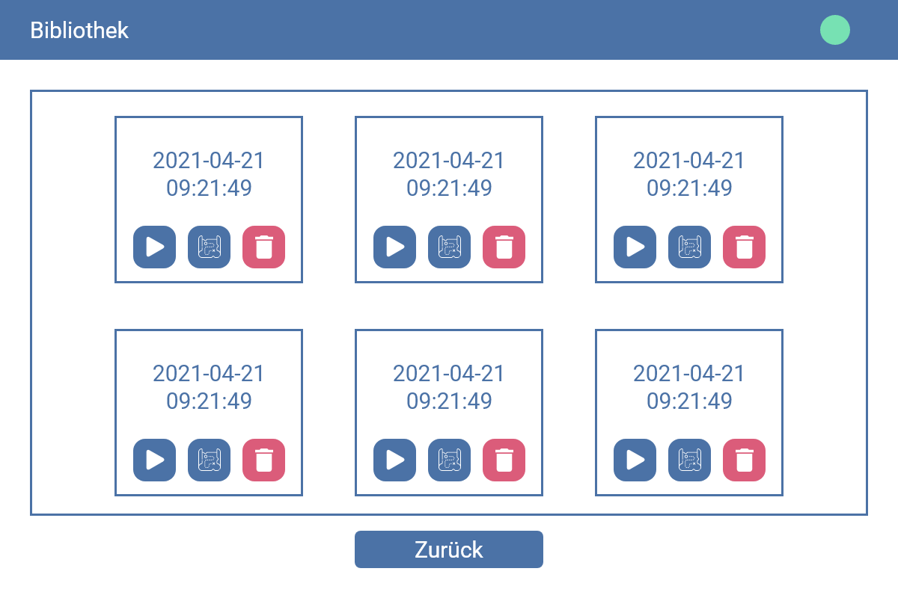
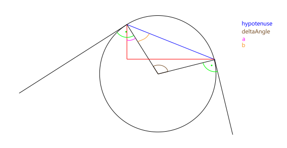
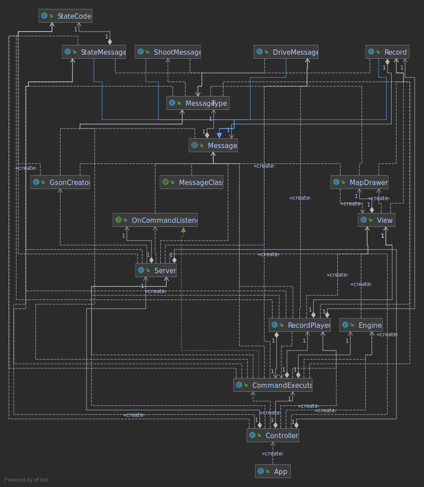

# Technische Dokumentation

## Entwicklungsumgebung

Die Desktop-Applikation haben wir als IDE Intellij IDEA verwendet. 
Für die Software des Mindstorms haben wir die Eclipse verwendet, da in dieser IDE das Mindstorms Plugin funktioniert.

### Setup

#### Eclipse (Mindstorms Software)

1. Eclipse installieren
2. [leJOS-Software](https://sourceforge.net/projects/lejos/) installieren
3. Help > Eclipse Marketplace...
4. `leJOS EV3 Plug-In` installieren
5. Mindstorms Sub-Projekt klonen
2. JRE 7 herunterladen
6. Die JRE 7 als Standard für das Projekt festlegen

#### Intellij IDEA (Desktop Software)

1. Intellij Idea installieren
2. App Sub-Projekt klonen
3. Projekt mit Gradle importieren

### Code-Style

1. Wir verwenden den Standard Intellij-Code-Style.
2. Wir benennen unsere Variablen in Englisch
3. Wir benutzen für die Benennung von Variablen den camelCase.

## Screen Design
<details>
  <summary>
  Screen Designs
  </summary>

  ### Start Scene

  

  ### Connect Scene

  

  ### Controller-Select Scene

  

  ### Drive Scene

  

  ### Help Scene

  

  ### Library Scene

  

</details>

## Verbindung PC – Mindstorms

Die Connection-Klasse stellt eine Verbindung zwischen der Software des Mindstorms und der Desktopapplikation her. Dabei beinhaltet diese
Klasse auch Methoden wie z. B. `send` und `receive`. Zum jeweiligen Empfangen und versenden
von [Message-Objekten](#message-klasse). Dabei repräsentiert der Mindstorms den Server und die Desktopapplikation den
Client.

### Bluetooth Pan-Netzwerk

Damit die beiden Geräte über Sockets miteinander kommunizieren können, müssen diese einem Bluetooth PAN-Netzwerk hinzugefügt
werden. In diesem PAN Netzwerk erhalten alle Teilnehmer eine IP-Adresse. Eine genaue Anleitung dazu befindet sich [hier](usermanual.md#verbindungs-setup).

### Server-Klasse

Für die Umsetzung dieser Klasse wurde der [`java.net.ServerSocket`](https://docs.oracle.com/javase/7/docs/api/java/net/ServerSocket.html) verwendet. 
Diese Klasse befindet sich in der Mindstorms-Software und öffnet einen Socket auf dem Port `18999`. 
Um das empfangen zu vereinfachen, haben wir einen Listener geschrieben, welcher auf Nachrichten wartet.

```java
// Main-Loop der Server-Klasse
while (running) {
    try {
        String message = dis.readUTF();
        if (onCommandListener != null) {
            onCommandListener.onCommand(gson.fromJson(message, Message.class));
        }
    } catch (IOException e) {
        e.printStackTrace();
    }
}
```

### Client-Klasse

Für die Umsetzung dieser Klasse wurde
der [`java.net.Socket`](https://docs.oracle.com/javase/7/docs/api/java/net/Socket.html) verwendet. Diese Klasse befindet
sich in der Desktop-Applikation und verbindet sich auf die [Server-Klasse](#server-klasse) des Mindstorms.

```java
public void send(Message message) {
    try {
        dos.writeUTF(gson.toJson(message));
        dos.flush();
    } catch (IOException e) {
        e.printStackTrace();
    }
}
```

### Message-Klasse

Die Message-Klasse ist eine abstrakte Parentklasse. Alle Nachrichten werden vor dem Senden zu
einem [JSON](https://www.json.org/json-de.html) konvertiert. Dafür verwenden wir
die [GSON-Library](https://github.com/google/gson) von Google. Bei der Implementation von GSON haben wir uns an
diesem [Tutorial](https://howtodoinjava.com/learningpaths/gson/) orientiert.

#### DriveMessage-Klasse

Diese Klasse erbt von der Message-Klasse. In ihr werden die neuen Geschwindigkeiten der beiden Motoren gespeichert.

#### StateMessage-Klasse

Diese Klasse erbt von der Message-Klasse. In ihr wird ein StateCode Enum übermittelt.

| Enum | Funktion      |
|:----:|---------------|
|SERVER_CLOSING|Antwort bevor der ServerSocket geschlossen wird|
|CONNECTION_OK|Antwort nach einem erfolgreichen Verbindungsaufbau|
|RECORDING_ENDED|Antwort sobald die Aufnahme fertig abgespielt wurde|
|ABORT_RECORDING|Anfrage zum abbrechen der Wiedergabe einer Aufnahme|

#### Record-Klasse

In der Record-Klasse werden mithilfe eines Send-Listener’s alle Befehle, welche an den Mindstorms gesendet werden, abgefangen und gespeichert.

## Steuereingaben

Die 3 verschiedenen Input-Handler befinden sich in der InputHandler-Klasse.

### Tastatur-Eingaben

Die Eingaben auf der Tastatur werden mit dem InputHandler verarbeitet. Dieser verändert die Geschwindigkeit der Räder
anhand der gedrückten Tasten.

### Joystick-Eingaben

Die Eingaben eines angeschlossenen Joystick werden
durch [JInput](https://javadoc.io/doc/net.java.jinput/jinput/latest/net/java/games/input/package-summary.html)
verarbeitet. Dabei haben wir uns an folgendem [Beispiel](https://jinput.github.io/jinput/) zurechtgefunden. Zur
Berechnung der Bewegungen haben wir folgenden [Code](https://www.impulseadventure.com/elec/robot-differential-steering.html) angepasst.
Um die DLL's von JInput zu laden verwenden wir die [Apache Commons IO](https://commons.apache.org/proper/commons-io/) Library.

*Dieses Gerät unterstützt auch Hot-Plug.*

### Gamepad-Eingaben

Die Eingaben eines angeschlossenen Gamepad werden auch
durch [JInput](https://javadoc.io/doc/net.java.jinput/jinput/latest/net/java/games/input/package-summary.html)
verarbeitet. Die Berechnung der Bewegungen ist sehr ähnlich zu der des Joystick.


*Dieses Gerät unterstützt auch Hot-Plug.*

## Motorsteuerung

Für die Steuerung des Motors ist unsere `Engine`-Klasse zuständig. Wenn die Klasse instanziiert wird, werden zuerst die
beiden Motoren `B` und `A` synchronisiert. Sie werden synchronisiert, damit sie später gleichzeitig stoppen oder
starten können. Die Motoren werden folgendermassen synchronisiert:

```java
leftMotor.synchronizeWith(new RegulatedMotor[] { rightMotor });
```

### orientateArm-Methode

In dieser wird der Arm kalibriert. Dabei wird der Arm in kleinen Schritten nach oben bewegt, um diesen nach oben
auszurichten. Zuerst setzen wir die Geschwindigkeit auf 1000. Mit `armMotor.setStallThreshold(10, 1);` setzen wir die
Blockier-Schwelle. Welche angibt, ab wann der Motor blockiert ist. die Werte 10 und 1 haben für uns am besten gepasst.
Nun rotieren wir den Motor immer ein wenig nach oben (bei uns 18°) solange er nicht blockiert ist.

### move-Methode

Mit der `move`-Methode können wir die Geschwindigkeit der einzelnen Räder anpassen. Diese Methode hat die
Signatur `(float, float)`. Der erste Parameter ist `leftSpeed` und der zweite `rightSpeed`.

1. Die Motoren synchronisieren
2. Die Geschwindigkeit des linken Motors setzten, wenn sie sich verändert hat
3. Die Geschwindigkeit des rechten Motors setzten, wenn sie sich verändert hat
4. Die Synchronisation beenden
5. Die vorherigen Geschwindigkeiten überschreiben

Zum 2. und 3. Punkt gehört das Stoppen des Motors oder die änderung der Rotationsrichtung.

### rotate-Methode

Mit der `rotate`-Methode können wir den Arm hoch und runterbewegen. Diese Methode hat keine Parameter. Von dieser
Methode aus wird mithilfe
eines [`ExecutorService`](https://docs.oracle.com/javase/7/docs/api/java/util/concurrent/ExecutorService.html) ein
anonyme Implementation des Interface [`Runnable`](https://docs.oracle.com/javase/7/docs/api/java/lang/Runnable.html)
gestartet. In der Implementation passiert Folgendes:

```java
if (isArmUp) {
	armMotor.rotate(-180);
} else {
	armMotor.rotate(180);
}
isArmUp = !isArmUp;
armMotor.stop();
armMotor.flt();
```

## Karte-Zeichner

Das Zeichnen der Karte findet in der `MapDrawer`-Klasse statt. Mithilfe
von [`Graphics2D`](https://docs.oracle.com/javase/7/docs/api/java/awt/Graphics2D.html) zeichnen wir auf
ein [`BufferedImage`](https://docs.oracle.com/javase/7/docs/api/java/awt/image/BufferedImage.html) die Linien und Kreis.
In der `draw`-Methode wird die grösste und kleinste X und Y-Koordinate herausgefunden, damit später ein Bild gezeichnet
werden kann, auf dem alle Grafiken Platz haben. Ganz am Schluss wird das Bild mit der
Methode [`SwingFXUtils.toFXImage`](https://docs.oracle.com/javafx/2/api/javafx/embed/swing/SwingFXUtils.html) von
einem [`java.awt.image.BufferedImage`](https://docs.oracle.com/javase/7/docs/api/java/awt/image/BufferedImage.html) in
ein [`javafx.scene.image.Image`](https://docs.oracle.com/javase/8/javafx/api/javafx/scene/image/Image.html) umgewandelt.

In der `interpretMessage`-Methode wird entschieden, ob jetzt ein Kreis, eine Linie oder gar nichts gezeichnet wird.

### drawArc-Methode

Die `drawArc`-Methode ist sehr komplex. Der Ablauf ist jedoch einfach.

1. radius herausfinden
2. Kreismitte herausfinden
3. Neuer Winkel herausfinden
4. Kreis zeichnen
5. Neue Position herausfinden

Für die Berechnungen wurde folgende Grafik zur Hilfe genommen.


Diese Methode hat dennoch einige __Fehler__. Aufgrund von fehlender Zeit und Komplexität konnte diese nicht behoben
werden.

### drawLine-Methode

Die `drawLine`-Methode ist simpel, da Mithilfe von dem Winkel ohne Probleme die Strecke herausgefunden werden kann.

## Klassendiagramm

### Desktop-Applikation


### Mindstorms-Applikation


